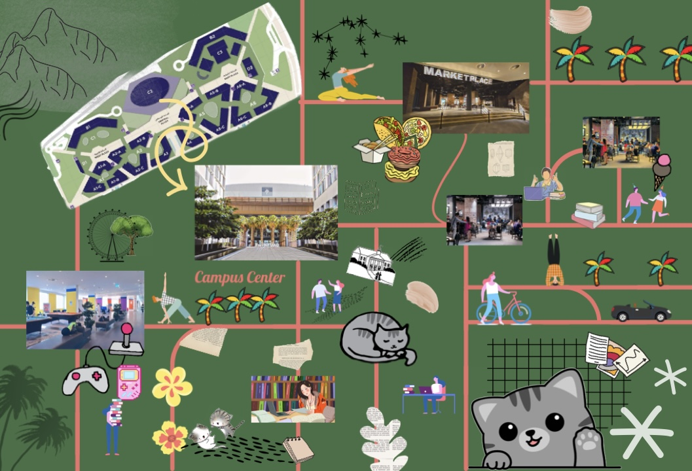

# fairwell-nyuad
## Project Name: Farewell NYUAD
For our sound project, we created Farewell NYUAD, a website designed to create an audio experience of life as a student on campus. Its primary purpose is to serve as a living keepsake for graduating students, giving them a chance to listen to the places they once occupied and experience the feeling of being on campus from wherever they are. Students open the site and are greeted by a nostalgic song, “See You Again” by Wiz Khalifa. They are then able to navigate through the website to six iconic campus locations: the Welcome Center, the ground floor of C2, the Baraha, the Convenience Store, the Marketplace, and the Palms. We strove to create a nostalgic experience, including heartfelt moments from the dialogue of different students. We came up with this idea as many of our members are seniors and leaving campus soon. We thought that creating something tied to campus and the different stories from our student body would be a gift to our future selves, to help us and other graduating students remember our time here using more than just photos.

**Process - Drafting - Concept and Storyline**:

We went through several iterations of the project. We had an initial idea to create a dark comic story themes as 'How they died', but decided on something more creative that could relate to the campus community. We then considered making a 3D version map of the campus, but then agreed that a 2D version would be fit better in an website environment. We then considered making soundscapes from all over campus, but narrowed our focus onto campus center where a lot of things happen. Thinking of ways to combine sound and location in a narrative format, we settled on the idea of a goodbye website for NYUAD seniors. Using images and sounds of campus, we would create a campus atmosphere online. 

This website is an opprotunity for NYUAD students to share their experiances and favorite places with other students that can benifit from others expreiance. 

**Process - Audio Recording**:
After booking a Zoom H5 recorder and other needed equipment from the Equipment Center, we traveled around C2 collecting sounds to render into complete soundscapes of each of the six locations we included in the site. We manually recorded individual sounds like the elevator doors opening and closing (along with the voice that announces it), the rolling ball of the foosball tables in the Baraha, the chirp of crickets at night, a suitcase rolling along the Highline, cars driving along the main road, conversations at the Palms, and music from the speakers in the Marketplace. We also supplemented these sounds as needed with clips from the Internet, although we tried to keep these to a minimum to make the soundscapes as accurate as possible. Among these clips were sounds of an industrial kitchen with clanging pots and a group of people talking (to create a more lively ambience in the Marketplace soundscape). We then edited these sounds together to create six soundscapes. Laid overtop of these scapes are the individual musings of students recounting either their favorite memories in each location or a thing they’d miss about the location. These stories were collected by Shahd and Naijah, who pulled people aside in C2 and asked them questions. 
The main task of the audio recording process was configuring the volume of each of the individual sounds in post-production. Students spoke at varying volume levels and speeds, and their voices had to be adjusted to be heard comfortably by the user. Each track (vocal or otherwise) also had to be normalized in relation to those around it, and background noise also had to be removed to eliminate as much cloudy noise as possible and maintain a high quality listening experience.  Lastly, after creating each soundscape, each one had to be adjusted so that the overall volumes of each were about the same. This would ensure a consistent and smooth listening experience over the course of the project.

**General Design and Interactivity**:
The general design of the website was inspired by the campus architecture as the buttons take you up and dawn left or right depending on what the audience wants to view. One goal we had was to give the audience the feel that they are actually moving around the campus architecture, and so the buttons reflect the actual position of different campus locations in relation to one another.
The aesthetic theme of the site is also university-related, with NYUAD purple as a background color and a welcoming font used for the buttons.

The C2 page in the website consisted of a 6 divs, each one with the backgroud image set as an image of each of its location. Each time a button is pressed, the goToImage function loops through each image div and shifts the position of each up/down by 100% height, so that only the div of the current location is in the viewport, which is how we achieved the visual effect of going up/down. Each time the goToImage function is called, it checks if audio is currently playing and if so, it pauses it to ensure that audios don't overlap. Then it loads the correct audio into a variable and starts playing it.  

**Work Distribution**:
We all brainstormed for different ideas and planned the process and wireframe of how it will work. Then we divided the work among ourselves. We all worked on the README file. 

Shahd: Did a map that we did not use. Helped in recording sound. Helped in doing the code mainly worked on the index HTMl and the buttons. 

Naijah: Recorded all sounds and mixed them for the 6 soundscapes.

Kash:

Q M:

**Reflection and Evaluation**: 

The overall some issues we ran into were trying to resize images to fit the screen better, our inability to find a place for the map to fit into the project and some communication issues. 

The final output of the project was similar to what we were looking for. However, there is always more for improvement. Some stuff that can be done to make the website better is add more audio and stories that people share with us about campus. Also the buttons and how they navigate the viewr through campus. Maybe we can make them more integrated into how a person would actually move around campus. 